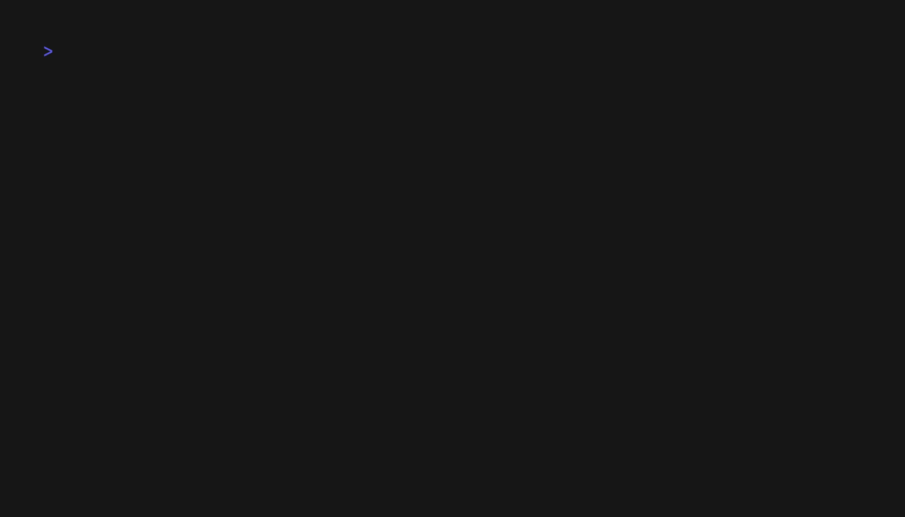

# 🚀 Tap

**Beautiful, interactive command-line prompts for Go** - A Go port of the popular TypeScript [Clack](https://clack.cc/) library.

<div>
  
</div>

> ⚠️ **Heavy Development**: This project is currently in heavy development. APIs may change, and some features are still being implemented. Use with caution in production environments.

## Why Tap?

Building interactive CLI applications shouldn't be complex. Tap brings the elegant, minimal design philosophy of Clack to the Go ecosystem, offering:

- **Event-driven architecture** for responsive, race-condition-free prompts
- **Beautiful styling** with consistent visual design and Unicode symbols
- **Type-safe APIs** with generic support for strongly-typed selections
- **Comprehensive testing** with built-in mock utilities
- **Minimal dependencies** - Only essential terminal and keyboard libraries

## Features

### ✅ Available Now

**Core Components:**

- **Text Input** - Single-line input with cursor navigation, validation, placeholders, and default values
- **Password Input** - Masked text input for sensitive data
- **Confirm** - Yes/No prompts with customizable labels and keyboard navigation
- **Select** - Single selection from typed options with hints and color-coded display
- **Progress Bar** - Animated progress indicators with multiple styles (light, heavy, block)
- **Spinner** - Loading indicators with dots, timer, or custom frames
- **Message Primitives** - Intro, outro, cancel messages, and styled boxes
- **Event System** - Race-condition-free event loop architecture

**Developer Experience:**

- **Mock Testing** - Built-in utilities for reliable prompt testing
- **Type Safety** - Generic APIs for strongly-typed selections
- **Terminal Management** - Raw mode handling, keyboard input, and cursor control

### 🔄 Coming Soon

- **Multi-Select** - Multiple selection from lists with checkboxes
- **Autocomplete** - Text input with suggestion dropdown
- **Group** - Grouped prompts for complex workflows

## Installation

```bash
go get github.com/yarlson/tap@latest
```

## Quick Start

### Usage

Use the `tap` package:

```go
package main

import (
    "fmt"

    "github.com/yarlson/tap"
)

func main() {
    name := tap.Text(tap.TextOptions{Message: "What's your name?"})
    confirmed := tap.Confirm(tap.ConfirmOptions{Message: fmt.Sprintf("Hello %v! Continue?", name)})
    if confirmed {
        tap.Outro("Let's go! 🎉")
    }
}
```

## API Examples

### Text Input with Validation (tap API)

```go
import "errors"

email := tap.Text(tap.TextOptions{
    Message:      "Enter your email:",
    Placeholder:  "user@example.com",
    DefaultValue: "anonymous@example.com",
    Validate: func(input string) error {
        if !strings.Contains(input, "@") {
            return errors.New("Please enter a valid email")
        }
        return nil
    },
})
```

### Password Input (masked)

```go
pwd := tap.Password(tap.PasswordOptions{Message: "Enter your password:"})
fmt.Printf("Password length: %d\n", len(pwd))
```

### Confirmation with Custom Labels

```go
proceed := tap.Confirm(tap.ConfirmOptions{
    Message:      "Deploy to production?",
    Active:       "Deploy",
    Inactive:     "Cancel",
    InitialValue: false,
})
```

### Type-Safe Selection

```go
type Environment string

envs := []tap.SelectOption[Environment]{
    {Value: "dev", Label: "Development", Hint: "Local development"},
    {Value: "staging", Label: "Staging", Hint: "Pre-production testing"},
    {Value: "prod", Label: "Production", Hint: "Live environment"},
}

env := tap.Select(tap.SelectOptions[Environment]{
    Message: "Choose deployment target:",
    Options: envs,
})
```

### Progress Bar

```go
prog := tap.NewProgress(tap.ProgressOptions{
    Style:  "heavy",     // "light", "heavy", or "block"
    Max:    100,         // total units of work
    Size:   40,          // bar width in characters
})

prog.Start("Processing...")
for i := 0; i <= 100; i += 10 {
    time.Sleep(200 * time.Millisecond)
    prog.Advance(10, fmt.Sprintf("Step %d/10", i/10+1))
}
prog.Stop("Complete!", 0) // 0=success, 1=cancel, 2=error
```

### Spinner

```go
// Default spinner (dots)
spin := tap.NewSpinner(tap.SpinnerOptions{})
spin.Start("Connecting")
// ... do work ...
spin.Stop("Connected", 0)

// Timer indicator
timerSpin := tap.NewSpinner(tap.SpinnerOptions{Indicator: "timer"})
timerSpin.Start("Fetching data")
// ... do work ...
timerSpin.Stop("Done", 0)

// Custom frames and delay
customSpin := tap.NewSpinner(tap.SpinnerOptions{Frames: []string{"-", "\\", "|", "/"}, Delay: 100 * time.Millisecond})
customSpin.Start("Working")
// ... do work ...
customSpin.Stop("Complete", 0)
```

## Architecture

Tap uses a clean, layered architecture designed for performance and reliability:

### Package Structure

- **`core`** - Core prompt engine with unstyled, functional prompts
- **`prompts`** - Beautifully styled prompts built on top of core
- **`terminal`** - Terminal management, keyboard input, and cursor control

### Event-Driven Design

All prompts use a pure event loop architecture for race-condition-free operation:

```go
// Single event loop processes all state changes
for event := range prompt.events {
    event(&state)                    // Update state
    prompt.render(&state)            // Render changes
    prompt.updateSnapshot(&state)    // Update atomic snapshot
}
```

This approach eliminates the need for mutexes while providing excellent performance and thread safety through atomic snapshots.

## Testing

Tap includes comprehensive test coverage with built-in mock utilities:

```bash
# Run all tests
go test ./...

# Test with race detection
go test -race ./...

# Test specific packages
go test ./prompts -v
go test ./core -v
```

### Mock Testing Example

```go
func TestTextPrompt(t *testing.T) {
    mockInput := core.NewMockReader()
    mockOutput := core.NewMockWriter()

    // Simulate user typing "hello" and pressing enter
    mockInput.SendString("hello")
    mockInput.SendKey("return")

    result := prompts.Text(prompts.TextOptions{
        Message: "Enter text:",
        Input:   mockInput,
        Output:  mockOutput,
    })

    assert.Equal(t, "hello", result)
}
```

### Using Tap with LLMs

To help language models reliably use this library, provide them a compact API reference and constraints. This repo includes [README.LLM.md](README.LLM.md) for that purpose.

- Prefer pasting the contents of `README.LLM.md` into the LLM context (system or first user message)
- Explicitly state the module path `github.com/yarlson/tap` and that returns are typed
- Ask for runnable Go code with proper imports

Prompt template:

```text
System:
You are a Go coding agent. Use this library to build interactive terminal prompts.

API cheat sheet:
<paste README.LLM.md here>

User:
Write a Go program that:
- asks for name and email (validate email)
- asks to confirm, then shows an outro.
Return a complete main.go.
```

Testing template (mock I/O):

```text
System:
Use mocks for terminal I/O. In tests, call tap.SetTermIO(in, out) with core mocks.

User:
Write a table-driven test for Text/Confirm using core.NewMockReadable/NewMockWritable and tap.SetTermIO.
```

### Testing tap helpers (override terminal I/O)

Tap helpers open a terminal per call by default. In tests, you can override input/output to avoid opening a real terminal:

```go
in := core.NewMockReadable()
out := core.NewMockWritable()

tap.SetTermIO(in, out)
defer tap.SetTermIO(nil, nil)

go func() {
  _ = tap.Text(tap.TextOptions{Message: "Your name:"})
}()

in.EmitKeypress("A", core.Key{Name: "a"})
in.EmitKeypress("", core.Key{Name: "return"})

// Assert output frames via out.Buffer
```

## Examples

Explore working examples in the [`examples/`](examples/) directory:

```bash
# Try different prompt types
go run examples/text/main.go      # Text input with validation
go run examples/password/main.go  # Password input (masked)
go run examples/confirm/main.go   # Yes/No confirmations
go run examples/select/main.go    # Single selection menus
go run examples/progress/main.go  # Progress bars and status
go run examples/spinner/main.go   # Spinners (dots, timer, custom frames)
go run examples/multiple/main.go  # Complete workflow example
```

Each example demonstrates different features and can serve as starting points for your applications.

## Development Status

Tap is in **active development**. Core functionality is stable and tested, but APIs may evolve. Current status:

- ✅ **Stable**: Text, Confirm, Select prompts with full styling
- ✅ **Stable**: Progress bars and message primitives
- ✅ **Stable**: Event loop architecture and terminal management
- 🔄 **In Progress**: Additional prompt types and enhanced styling
- 📋 **Planned**: Documentation site, themes, and advanced features

## Contributing

Contributions welcome! Areas where help is needed:

- **New Prompt Types** - Multi-select, autocomplete
- **Enhanced Styling** - Themes, custom symbols, color schemes
- **Documentation** - API docs, tutorials, more examples
- **Testing** - Cross-platform testing, edge cases, performance
- **Bug Reports** - Issues with keyboard handling or rendering

### Development Setup

```bash
git clone https://github.com/yarlson/tap.git
cd tap
go test ./...                    # Run tests
go run examples/text/main.go     # Try examples
```

Please follow Go best practices, maintain test coverage above 80%, and use the event-driven architecture patterns established in the codebase.

## License

MIT License - see [LICENSE](LICENSE) file for details.

## Acknowledgments

- **[Clack](https://clack.cc/)** - The original TypeScript library that inspired this project
- **[@eiannone/keyboard](https://github.com/eiannone/keyboard)** - Cross-platform keyboard input for Go
- The Go community for excellent tooling and libraries

## Links

- **Documentation**: [Package docs on pkg.go.dev](https://pkg.go.dev/github.com/yarlson/tap)
- **Original Clack**: [clack.cc](https://clack.cc/)
- **Issues & Feature Requests**: [GitHub Issues](https://github.com/yarlson/tap/issues)
- **Examples**: [`examples/` directory](examples/)

---

Built with ❤️ for developers who value simplicity and speed.
