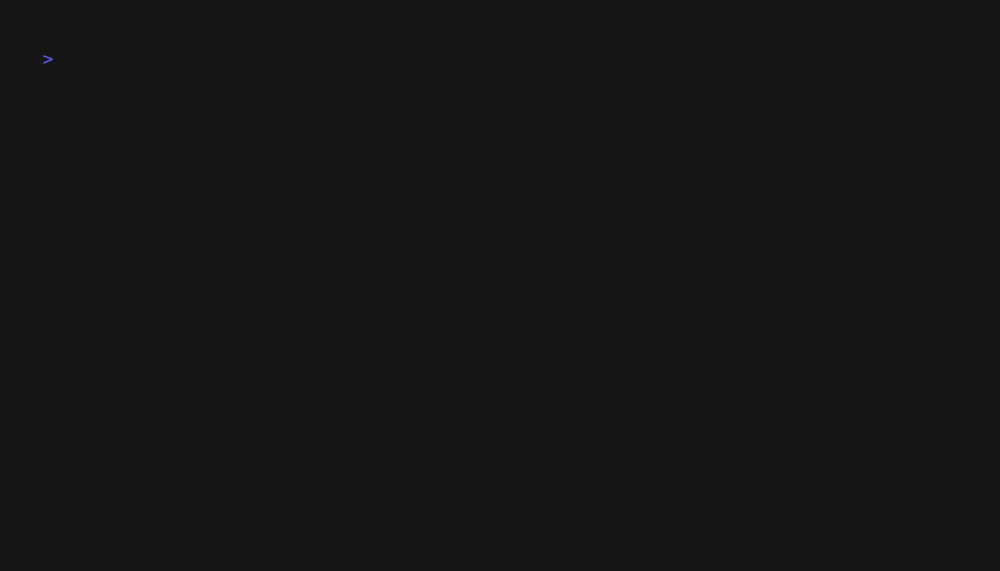

# Tap

**Beautiful, interactive command-line prompts for Go** — A Go port inspired by the TypeScript [Clack](https://clack.cc/) library.

<div>
  
</div>

## Why Tap?

Building CLI applications shouldn't require wrestling with terminal complexities. Tap provides elegant, type-safe prompts with beautiful Unicode styling, letting you focus on your application logic instead of terminal management.

## Features

- 🎯 **Type-safe prompts** with Go generics for strongly-typed selections
- 🎨 **Beautiful styling** with consistent Unicode symbols and colors
- ⚡ **Zero-config** terminal management with automatic cleanup
- 🧪 **Testing utilities** with built-in mocks for reliable testing
- 📦 **Minimal dependencies** — only essential terminal libraries

### Available Components

- **Text Input** — Single-line input with validation, placeholders, and defaults
- **Autocomplete** — Text input with inline, navigable suggestions (Tab to accept)
- **Password Input** — Masked input for sensitive data
- **Confirm** — Yes/No prompts with customizable labels
- **Select** — Single selection from typed options with hints
- **MultiSelect** — Multiple selection with checkboxes
- **Spinner** — Loading indicators with dots, timer, or custom frames
- **Progress Bar** — Animated progress indicators (light, heavy, or block styles)
- **Stream** — Real-time output with a start/write/stop lifecycle
- **Messages** — Intro, outro, and styled message boxes
- **Box** — A flexible, styled box for surrounding content
- **Table** — A component for displaying data in a tabular format
- **Context Support** — All interactive prompts support context cancellation and timeouts

## Installation

```bash
go get github.com/yarlson/tap@latest
```

### Requirements

- Go 1.20+
- A TTY-capable terminal (ANSI escape sequences); Linux/macOS and modern Windows terminals supported

## Quick Start

```go
package main

import (
    "context"
    "fmt"
    "github.com/yarlson/tap"
)

func main() {
    ctx := context.Background()

    tap.Intro("Welcome! 👋")

    name := tap.Text(ctx, tap.TextOptions{
        Message: "What's your name?",
        Placeholder: "Enter your name...",
    })

    confirmed := tap.Confirm(ctx, tap.ConfirmOptions{
        Message: fmt.Sprintf("Hello %s! Continue?", name),
    })

    if confirmed {
        tap.Outro("Let's go! 🎉")
    }
}
```

### Controls

- Navigate: Arrow keys or `h`/`j`/`k`/`l`
- Submit: `Enter`
- Cancel: `Ctrl+C` or `Esc`
- Toggle (MultiSelect): `Space`
- Accept suggestion (Autocomplete): `Tab`

## API Examples

### Text Input with Validation

```go
email := tap.Text(ctx, tap.TextOptions{
    Message:      "Enter your email:",
    Placeholder:  "user@example.com",
    DefaultValue: "anonymous@example.com",
    Validate: func(input string) error {
        if !strings.Contains(input, "@") {
            return errors.New("Please enter a valid email")
        }
        return nil
    },
})
```

### Autocomplete

```go
// Define a simple suggest function
suggest := func(input string) []string {
    all := []string{"Go", "Golang", "Python", "Rust", "Java"}
    if input == "" { return all }
    low := strings.ToLower(input)
    var out []string
    for _, s := range all {
        if strings.Contains(strings.ToLower(s), low) {
            out = append(out, s)
        }
    }
    return out
}

lang := tap.Autocomplete(ctx, tap.AutocompleteOptions{
    Message:     "Search language:",
    Placeholder: "Start typing...",
    Suggest:     suggest,
    MaxResults:  6,
})
```

### Password Input

```go
password := tap.Password(ctx, tap.PasswordOptions{
    Message: "Enter a new password:",
    Validate: func(input string) error {
        if len(input) < 8 {
            return errors.New("Password must be at least 8 characters long")
        }
        return nil
    },
})
```

### Type-Safe Selection

```go
type Environment string

environments := []tap.SelectOption[Environment]{
    {Value: "dev", Label: "Development", Hint: "Local development"},
    {Value: "staging", Label: "Staging", Hint: "Pre-production testing"},
    {Value: "production", Label: "Production", Hint: "Live environment"},
}

env := tap.Select(ctx, tap.SelectOptions[Environment]{
    Message: "Choose deployment target:",
    Options: environments,
})

// env is strongly typed as Environment
```

### MultiSelect

```go
languages := []tap.SelectOption[string]{
    {Value: "go", Label: "Go"},
    {Value: "python", Label: "Python"},
    {Value: "javascript", Label: "JavaScript"},
}

selected := tap.MultiSelect(ctx, tap.MultiSelectOptions[string]{
    Message: "Which languages do you use?",
    Options: languages,
})

fmt.Printf("You selected: %v
", selected)
```

### Progress Indicators

```go
// Spinner
spinner := tap.NewSpinner(tap.SpinnerOptions{})
spinner.Start("Loading...")
// ... do work ...
spinner.Stop("Done!", 0)

// Progress Bar
progress := tap.NewProgress(tap.ProgressOptions{
    Style: "heavy",  // "light", "heavy", or "block"
    Max:   100,
    Size:  40,
})

progress.Start("Processing...")
for i := 0; i <= 100; i += 10 {
    time.Sleep(200 * time.Millisecond)
    progress.Advance(10, fmt.Sprintf("Step %d/10", i/10+1))
}
progress.Stop("Complete!", 0)
```

### Stream

```go
stream := tap.NewStream(tap.StreamOptions{ShowTimer: true})
stream.Start("Streaming output...")
stream.WriteLine("First line of output.")
time.Sleep(500 * time.Millisecond)
stream.WriteLine("Second line of output.")
stream.Stop("Stream finished.", 0)
```

### Table

```go
headers := []string{"Field", "Value"}
rows := [][]string{
  {"Name", "Alice"},
  {"Languages", "Go, Python"},
}

tap.Table(headers, rows, tap.TableOptions{
  ShowBorders:   true,
  IncludePrefix: true,
  HeaderStyle:   tap.TableStyleBold,
  HeaderColor:   tap.TableColorCyan,
})
```

### Message Helpers

```go
tap.Intro("Welcome! 👋")
tap.Message("Here's what's next:")
tap.Outro("Let's go! 🎉")
```

Produces:

```
┌  Welcome! 👋
│
│
◇  Here's what's next:
│
└  Let's go! 🎉
```

### Styled Messages (Box)

```go
// Message box with custom styling
tap.Box("This is important information!", "⚠️ Warning", tap.BoxOptions{
    Rounded:       true,
    FormatBorder:  tap.CyanBorder, // also GrayBorder, GreenBorder, YellowBorder, RedBorder
    TitleAlign:    tap.BoxAlignCenter,
    ContentAlign:  tap.BoxAlignCenter,
})
```

### Usage Tips

- Always call `Stop` on `Spinner`/`Progress`/`Stream` to restore the terminal state.
- For `Select[T]`/`MultiSelect[T]`, you can omit the type parameter if it can be inferred from the options' type.

### Context Support and Cancellation

All interactive prompts support Go's context package for cancellation and timeouts:

```go
// With timeout
ctx, cancel := context.WithTimeout(context.Background(), 30*time.Second)
defer cancel()

name := tap.Text(ctx, tap.TextOptions{
    Message: "Enter your name (30s timeout):",
})

// With cancellation
ctx, cancel := context.WithCancel(context.Background())
go func() {
    time.Sleep(5*time.Second)
    cancel() // Cancel after 5 seconds
}()

result := tap.Confirm(ctx, tap.ConfirmOptions{
    Message: "Quick decision needed:",
})

// On cancel or timeout, helpers return zero values
// (e.g., Text/Password → "", Confirm → false, Select[T] → zero T).
```

## OSC 9;4 Integration (Terminal Progress)

Tap emits OSC 9;4 control sequences to signal progress/spinner state to compatible terminals. Unsupported terminals ignore these sequences (no-op), so visuals remain unchanged.

What’s emitted automatically:

- Spinner:
  - Start → indeterminate: `ESC ] 9 ; 4 ; 3 ST`
  - Stop → always clear: `ESC ] 9 ; 4 ; 0 ST`
- Progress:
  - On render when percent changes → `ESC ] 9 ; 4 ; 1 ; <PCT> ST`
  - Stop → always clear: `ESC ] 9 ; 4 ; 0 ST`

Notes:

- Terminator: Tap uses ST (`ESC \`) for robustness. Some terminals also accept BEL (``).
- Throttling: Progress only emits a new percentage when it changes to avoid spam.
- Multiplexers: tmux/screen may swallow OSC sequences unless configured to passthrough.

## Testing

Tap includes comprehensive testing utilities. Override terminal I/O in tests:

```go
func TestYourPrompt(t *testing.T) {
    // Create mock I/O
    mockInput := tap.NewMockReadable()
    mockOutput := tap.NewMockWritable()

    // Override terminal I/O for testing
    tap.SetTermIO(mockInput, mockOutput)
    defer tap.SetTermIO(nil, nil)

    // Simulate user input
    go func() {
        mockInput.EmitKeypress("test", tap.Key{Name: "t"})
        mockInput.EmitKeypress("", tap.Key{Name: "return"})
    }()

    result := tap.Text(ctx, tap.TextOptions{Message: "Enter text:"})
    assert.Equal(t, "test", result)
}
```

Alternatively, pass I/O per call by setting `Input` and `Output` on options like `TextOptions`, `ConfirmOptions`, etc. This avoids using the global override when you need finer control.

Run tests:

```bash
go test ./...
go test -race ./...  # with race detection
```

## Examples

Explore working examples in the [`examples/`](examples/) directory. Each example is self-contained and can be run directly.

```bash
# Basic prompts
go run examples/autocomplete/main.go
go run examples/text/main.go
go run examples/password/main.go
go run examples/confirm/main.go
go run examples/select/main.go
go run examples/multiselect/main.go

# Long-running tasks
go run examples/spinner/main.go
go run examples/progress/main.go
go run examples/stream/main.go

# Output and formatting
go run examples/table/main.go

# Complete workflow
go run examples/multiple/main.go
```

## Architecture

Tap uses an event-driven architecture with atomic state management for race-condition-free operation. The library automatically handles:

- Terminal raw mode setup/cleanup
- Keyboard input processing
- Cursor positioning and output formatting
- Cross-platform compatibility

The main package provides a clean API while internal packages handle terminal complexity.

## Status

Tap API is **stable** and production-ready. The library follows semantic versioning and maintains backward compatibility.

## Contributing

Contributions welcome! Please:

- Follow Go best practices and maintain test coverage
- Include examples for new features
- Update documentation as needed

## License

MIT License - see [LICENSE](LICENSE) file for details.

## Acknowledgments

- **[Clack](https://clack.cc/)** — The original TypeScript library that inspired this project
- **[@eiannone/keyboard](https://github.com/eiannone/keyboard)** — Cross-platform keyboard input
- The Go community for excellent tooling and feedback

---

Built with ❤️ for developers who value simplicity and speed.
